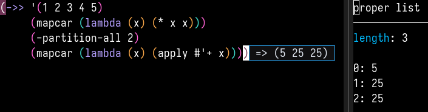

# eros-inspector

*Glue between eros and inspector*

This package provides glue between the popular elisp development packages [eros](https://github.com/xiongtx/eros) and [inspector](https://github.com/mmontone/emacs-inspector). \
No longer do you have to choose between an evaluation overlay and a nice representation of evaluation results.

`eros-inspector-eval-last-sexp` combines `eros-eval-last-sexp` and `inspector-inspect-last-sexp` \
`eros-inspector-eval-defun` combines `eros-eval-defun` and `inspector-inspect-defun`

### Installation

`eros-inspector` is available on MELPA and MELPA Stable.

Install it like you would any other emacs package.

### Configuration

I highly recommend setting `inspector-switch-to-buffer` to `nil`.

To get the most out of the emacs inspector, I suggest you keep it open at all times in a small side window.
